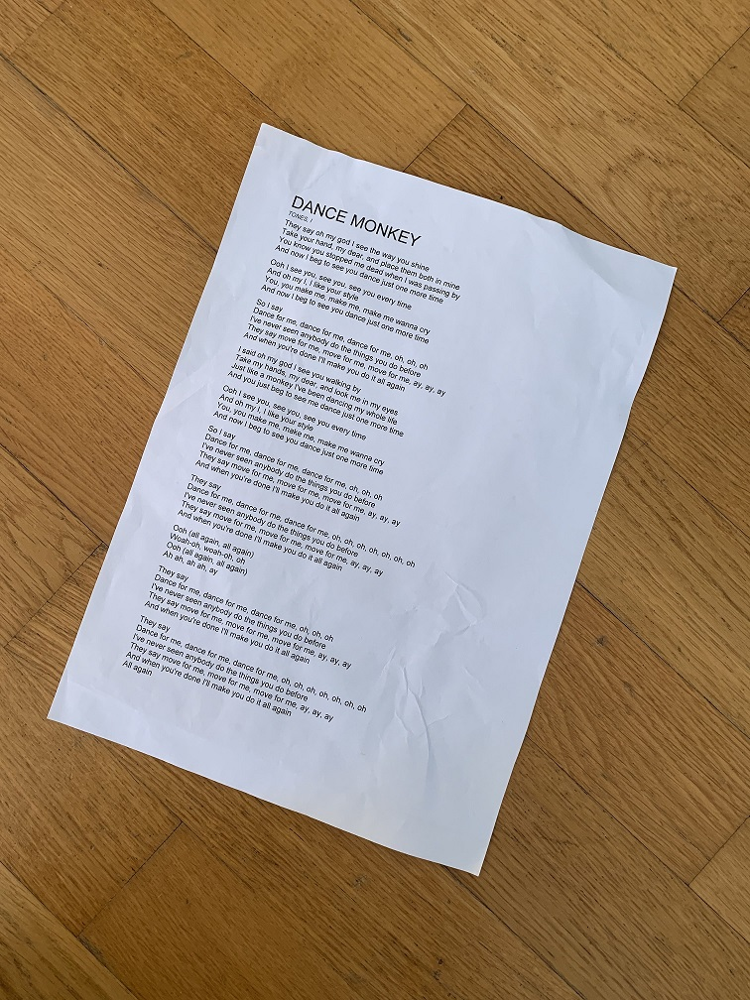
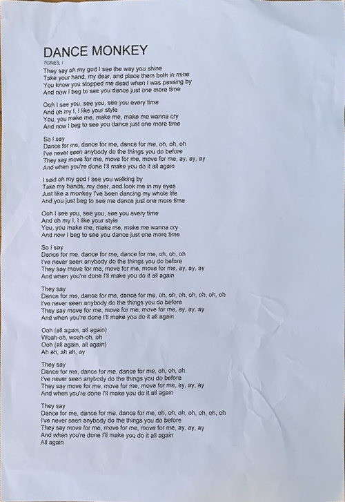

# documentRectifier
A project crated when to learn open cv better.

Disclamer: This is probably not an optimal way to fix document skew.
Also note that the way I calculate error is not perfect, as a document in perspective will give 
corners that are not 90 degress, thus giving higher error.

Hope people can use this project to look at how to use
grabcut, adaptive thresholding, homography, contours and angle calculations from vectors.

Usage: 
python documentrectifier.py example.jpg

Input document:
 

Output document:
 

